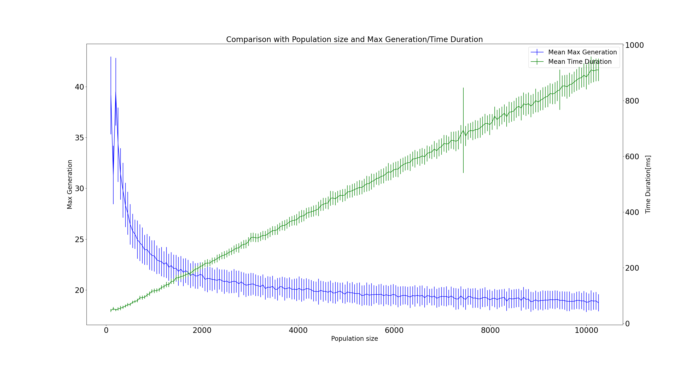

# Description
OneMax Problem benchmark test for Genetic Algorithm.

Example of Result
</img>

# Result

- Comparison with Population size and Max Generation / Code Execution Time Duration
</img>

- Comparison with Mutation Rate and Max Generation / Code Execution Time Duration
</img>

- Comparison with Tournament size and Max Generation / Code Execution Time Duration
</img>
