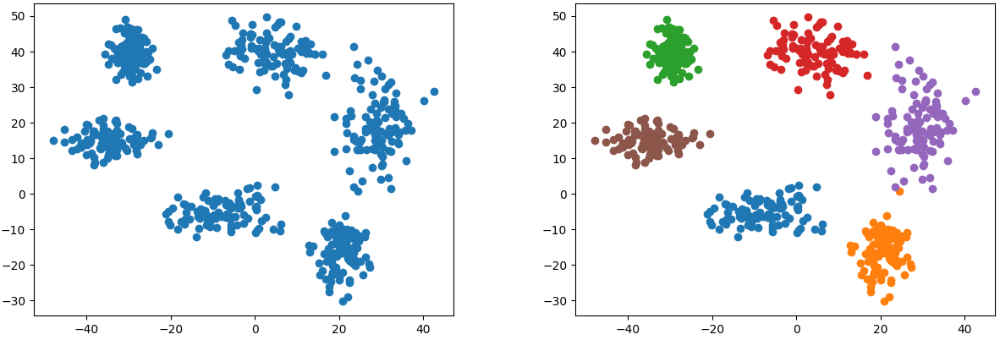

# Hard-Clustering and Soft-Clustering

I made basic clustering algorithm using python from scratch with numpy. Not for general use, not optimized, just for study.

## Requirement
```
numpy
tqdm
```

## K-Means++ for Hard-Clustering
### Basic Algorithm of K-Means
1. Pick n data points that will act as the initial centroids.
2. Calculate the Euclidean distance of each data point from each of the centroid points selected in step 1.
3. Form data clusters by assigning every data point to whichever centroid it has the smallest distance from.
4. Take the average of each formed cluster. The mean points are our new centroids.

### Initialize Algorithm for K-Means++
1. The first centroid is selected randomly.
2. Calculate the Euclidean distance between the centroid and every other data point in the dataset. The point farthest away will become our next centroid.
3. Create clusters around these centroids by associating every point with its nearest centroid.
4. The point which has the farthest distance from its centroid will be our next centroid.
5. Repeat steps 3 and 4 until n number of centroids are located. 

### Usage example
```python
km = clustering.Kmeans(data, n_cluster, max_trial)
km.fit()
predicted_label = km.predict(test_data)
```

### Random sample clustering example


## Fuzzy C-Means for Soft-Clustering
### Basic Algorithm
1. Choose a number of clusters.
2. Assign coefficients randomly to each data point for being in the clusters.
3. Repeat until the algorithm has converged.
   1. Compute the centroid for each cluster.
   1. For each data point, compute its coefficients of being in the clusters.

### Usage example
```python
fcm = clustering.FCM(data, n_cluster, m_fuzziness, max_trial)
fcm.fit()
predicted_posibility = fcm.predict(test_data)
```

### Image segmentation example using FCM class


## Reference
1. [K Means Clustering, Wikipedia](https://en.wikipedia.org/wiki/K-means_clustering)
2. [Fuzzy Clustering, Wikipedia](https://en.wikipedia.org/wiki/Fuzzy_clustering)
